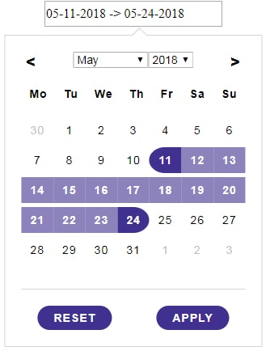
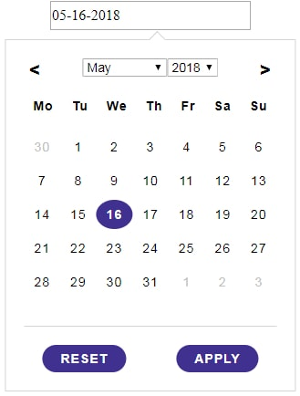
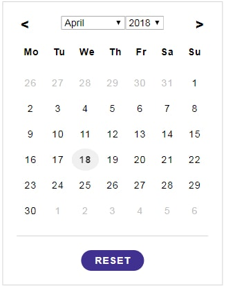

### React Date Picker

 This Date Picker built with React.js . This plugin has three modes **single date picker** , **double date picker** and **simple calender without date selection**.
 #### 1.Double date Picker mode
  In this mode user can select two dates , start date and end Date, from same calender .  
**Example:**  `<DoubleDatePickerCalender datePickerMode="2"/>;`

  

#### 2.Single date Picker mode
In this mode user can select only one dates from same calender.   
**Example:**  `<DoubleDatePickerCalender datePickerMode="1"/>;`

  

#### 3.Simple Calender mode
In this mode user will be able to select any date. It will behave as a simple calender without any date selection.  
**Example:**  `<DoubleDatePickerCalender datePickerMode="3"/>;`

  

### Why to use:
This plugin has follwing advantages:
* **Vast Scope ->** This Plugin contain 3 modes **i.e** single date picker, double date picker and simple calender  which is unique from others Plugin.
* **Simplicity ->** This plugin is easy to use. You can tweak the functionality just by altering props.
* **Native Approach ->** This plugin doesn't depend on any external library other than React JS.
* **Performance -->** This Plugin is highly optimized, and is lighting fast.
* **Light weight ->** This plugin is light weight as compare with other plugins and is packed with vast variety of functionalities.

### How to run
  * Install dependencies using command **npm install**
  * Start server using command **npm start**
  * It will take some time to start the server. When server will start, it will run on http://localhost:3000/

### To hides dates of previous month(in first row) and next month(in last row) add below line in your SASS

.double-date-picker-calender-outside-month-day{
  &-previous,&-next{
      visibility: hidden;
  }
}

### Props

|Props| Type | Default Value| Description|
|---------|------|--------|--------|
| monthMapping | Object |{  1:"January",   2:"Feburary",  3:"March",  4:"April",  5:"May",  6:"June",   7:"July",  8:"August",  9:"September",  10:"October",  11:"November",  12:"December"  }|change names of month by monthMapping props.monthMapping props  must of 12 properties|
|weekNames|Object| {  1:"Monday",   2:"Tuesday",  3:"Wednesday",  4:"Thrusday",  5:"Friday",  6:"Saturday", 7:"Sunday"}|change name of week 's days by weekNames props. weekNames props must of 7 properties|
|yearDropDownList|Object|{enable:false}|We can change year from dropdown list of years.  **Example:** yearDropDownList={enable:true,startYear:1922,endYear:2999}.   **Properties description** :-  **enable** - if true then it will show dropdown default false ,  **startYear (1900 Default Value)(Optional)** - first year of dropdown ,  **endYear (2199 Default Value)(Optional)** - last year of dropdown |
|monthDropDownList|Object|{enable:false}|We can change month from dropdown list of month.  **Example:** monthDropDownList={enable:true}.  **Properties description** :-  **enable** - if true then it will show dropdown default false |
|datePickerMode| Number | 2 |This calender has 3 date Picker mode :  **datePickerMode=1 for single date picker** , **datePickerMode=2 for double date picker** and  **datePickerMode=3 for normal calender**|
|weekNamesLength|Number or String|2|decide the number of character of week name |
|disablePastDates| Object | null | This props will disable past dates .  It has 2 modes :->  **mode 1** -> it will disable all dates before today date.  **Example:disablePastDates={mode:1}** ,  **mode 2**-> it disable all dates before the passed date(Object) by props. **Example:{mode:2,firstActiveDate:{date:18,month:1,year:2018}}** |
|disableFutureDates|Object|null| This props will disable future dates. **Example -> disablePastDates={lastActiveDate:{date:11,month:6,year:2018}}** |
|applyBtnText|  String | Apply | text for Apply button|
|hideApplyButton|  Boolean | false |if become true then Apply button will removed from DOM|
|resetBtnText|  String | Reset |text for Reset button|
|hideResetButton|  Boolean | false |if become true then Reset button will removed from DOM|
|hideInputField|  Boolean | false |removed input field from DoM and calender will be display by default|
|dateFormat| String | DD-MM-YYYY|date format after date selection|
|inputFieldStartDateText| String | |text in input field when start date(first date) is not selected|
|inputFieldEndDateText|  String |  |text in input field when end date(second Date) is not selected|
|datesSeperatorSymbol|  String |-> |symbol separating start date(first date) an end date(second Date) in Input field |
|defaultSelectedDate|Object|null| we can specify default selected date by this props.This property only work in single date picker mode **i.e**(datePickerMode=1) and double date picker mode**i.e**(datePickerMode=2)   **Example: defaultSelectedDate={startDate:{day:5,date:11,month:5,year:2018},endDate:{day:1,date:11,month:6,year:2018}}** .    **Note**:Use start date propperty only in single date picker mode(i.e datePickerMode=1) .This props will not work in Simple calender mode(i.e datePickerMode=3).|

### Methods
|Methods| Arguments | Description|
|---------|------|--------|
|startDateCallBack| NewStartDate: String , NewStartDateObject: Object{date:"",month:"",year:""} |It will execute when start Date(First Selected date) change.   **Example:** startDateCallBack={(startDate,startDateObj)=>{console.log(`start Date : ${startDate}`) ; console.log(startDateObj)}} Depending upon date it will show result like this -> **start Date :  05-11-2018  {day: "Friday", date: 11, month: 6, year: 2018}**|
|endDateCallBack| NewEndDate: String , NewEndDateObject: Object{date:"",month:"",year:""} |It will execute when end Date(Second Selected date) change .   **Example:** endDateCallBack={(endDate,endDateObj)=>{console.log(`start Date : ${endDate}`) ; console.log(endDateObj)}} Depending upon date it will show result like this -> **start Date :  06-11-2018  {day: "Monday", date: 11, month: 6, year: 2018}**|
|resetCallBack|None|function execute when Reset Button is clicked|
|applyCallBack| StartDate: String ,  EndDate: String ,     DateObject: Object{startDate:{..} , endDate:{..}} | execute when Apply button is clicked.  **Example:**applyCallBack={(startDate,endDate,dateObj) => console.log(startDate,endDate,dateObj)}   Depending upon date it will show result like this->**05-11-2018 06-11-2018 {startDate: {day: "Friday", date: 11, month: 5, year: 2018}, endDate: {day: "Monday", date: 11, month: 6, year: 2018}}**|
