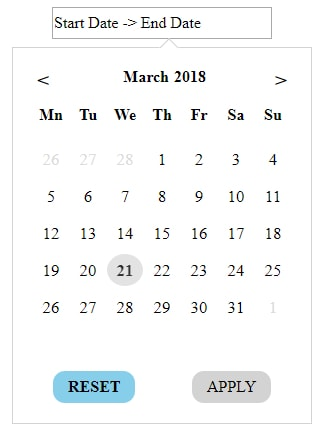
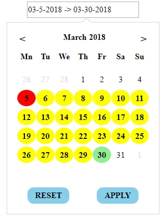

### Date Picker

 This Date Picker built with React.js . This plugin has three modes **single date picker** , **double date picker** and **simple calender without date selection**.

 #### 1.Double date Picker mode
  In this mode user can select two dates , start date and end Date, from same calender . 
** Example:**  <DoubleDatePickerCalender datePickerMode="2"/>

#### 2.Single date Picker mode
In this mode user can select only one dates from same calender.   
** Example:**  <DoubleDatePickerCalender datePickerMode="1"/>

#### 3.Simple Calender mode
In this mode user will be able to select any date. It will behave as a simple calender without any date selection.
** Example:**  <DoubleDatePickerCalender datePickerMode="3"/>

  
  

### How to run
  * Install dependencies by **npm install**
  * Start sever by **npm start**
  * It take some time to start a server after it will automatically Run Server on http://localhost:3000/

### To hides dates of previous month(in first row) and next month(in last row) add below line in your SASS

.double-date-picker-calender-outside-month-day{
  &-previous,&-next{
      visibility: hidden;
  }
}

### Props

|Props| Type | Default Value| Description|
|---------|------|--------|--------|
| monthMapping | Object |{  1:"January",   2:"Feburary",  3:"March",  4:"April",  5:"May",  6:"June",   7:"July",  8:"August",  9:"September",  10:"October",  11:"November",  12:"December"  }|change name of month and it must of 12 properties|
|weekNames|Object| {  1:"Monday",   2:"Tuesday",  3:"Wednesday",  4:"Thrusday",  5:"Friday",  6:"Saturday", 7:"Sunday"}|change name of week 's days and it must of 7 properties|
|yearDropDownList|Object|{enable:false}|We can change year from dropdown list of years. example for enable year dropdown {enable:true,startYear:1922,endYear:2999}.**Properties description** :- **enable** - if true then it will show dropdown default false , **startYear (1900 Default Value)(Optional)** - first year of dropdown , **endYear (2199 Default Value)(Optional)** - last year of dropdown |
|monthDropDownList|Object|{enable:false}|We can change month from dropdown list of month. example for enable month dropdown {enable:true}. **Properties description** :- **enable** - if true then it will show dropdown default false |
|datePickerMode| Number | 2 |1 for single date picker , 2 for double date picker and 3 for normal calender|
|weekNamesLength|Number or String|2|decide the number of character of week name |
|disablePastDates| Object | null | This props will disable past dates . It has 2 modes :-> **mode 1** -> it will disable all dates before today date. **Example:{mode:1}** , **mode 2**-> it disable all dates before the passed date(Object) by props. **Example:{mode:2,firstActiveDate:{date:18,month:1,year:2018}}** |
|disableFutureDates|Object|null| This props will disable future dates. **Example -> {lastActiveDate:{date:11,month:6,year:2018}}** |
|applyBtnText|  String | Apply | text for Apply button|
|hideApplyButton|  Boolean | false |if become true then Apply button will removed from DOM|
|resetBtnText|  String | Reset |text for Reset button|
|hideResetButton|  Boolean | false |if become true then Reset button will removed from DOM|
|hideInputField|  String | false |removed input field from DoM and calender will be display by default|
|dateFormat| String | DD-MM-YYYY|date format after date selection|
|inputFieldStartDateText| String | |text in input field when start date(first date) is not selected|
|inputFieldEndDateText|  String |  |text in input field when end date(second Date) is not selected|
|datesSeperatorSymbol|  String |-> |symbol separating start date(first date) an end date(second Date) in Input field |
|defaultSelectedDate|Object|null| we can specify default selected date by this props. **Example: {startDate:{day:5,date:11,month:5,year:2018},endDate:{day:1,date:11,month:6,year:2018}}** , use start date only for single date picker(i.e datePickerMode=1) .This props will not work in Simple calender mode(i.e datePickerMode=3).For Double date picker(i.e datePickerMode=2) use both startDate and endDate.|

### Methods
|Methods| Arguments | Description|
|---------|------|--------|
|startDateCallBack| NewStartDate: String , NewStartDateObject: Object{date:"",month:"",year:""} |execute when start Date(First Selected date) change|
|endDateCallBack| NewEndDate: String , NewEndDateObject: Object{date:"",month:"",year:""} |execute when end Date(Second Selected date) change|
|resetCallBack|None|function execute when Reset Button is clicked|
|applyCallBack| StartDate: String ,  EndDate: String ,     DateObject: Object{startDate:{..} , endDate:{..}} | execute when Apply button is clicked.|
